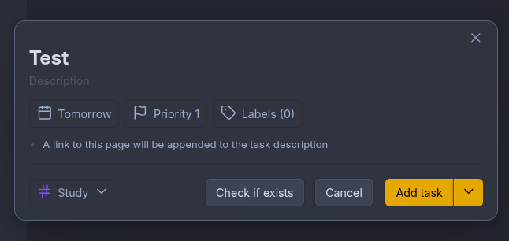
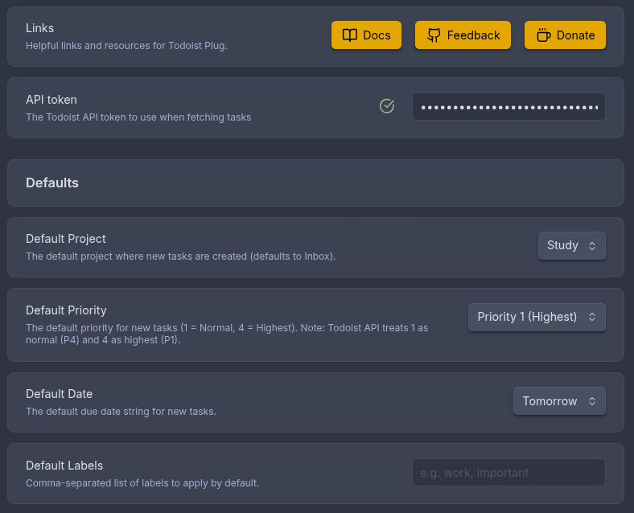
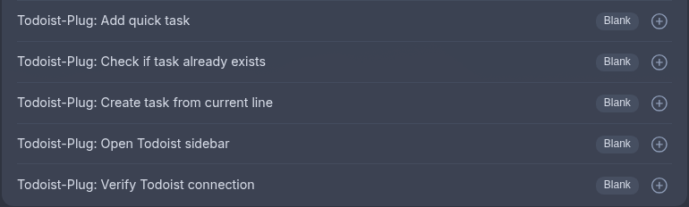

# Todoist-Plug

A robust integration between Todoist and Obsidian for managing your tasks natively within your knowledge base.

## Screenshots

### Quick Add Task Modal


### Minimal Settings


## Features

- **Quick Add Task Modal**: A beautiful, fully-featured modal for creating tasks without leaving Obsidian.
  - **Context-Aware**: Automatically populates the task title with your currently selected text, or falls back to your active file name.
  - **Obsidian Linking**: Can automatically append a deep link to your current Obsidian note directly into the Todoist task description.
  - **Premium Property Selectors**: Features rich, searchable popover menus for selecting **Projects**, **Labels**, **Dates**, and **Priorities**.
  - **Color Synchronization**: Pulls live project and label data straight from the Todoist API, mapping them accurately with their native Todoist colors.
- **Configurable Defaults**: A sleek, card-based Settings tab that allows you to configure your desired defaults for new tasks (Default Project, Default Priority, Default Date, and Default Labels).
- **Secure Authentication**: Uses Obsidian's native OS keychain (`app.secretStorage`) to securely store your Todoist API token locally, preventing it from syncing in plaintext.

## Available Commands

Here is a detailed list of all actions you can perform using the Obsidian command palette (`Cmd/Ctrl + P`):



- **Todoist-Plug: Add quick task**: Opens the Quick Add Task modal. This interface lets you visually configure the task's properties (projects, labels, priority, date). It auto-populates the task title with your currently selected text or active file name, and appends a deep link back to your current note in the task description.
- **Todoist-Plug: Create task from current line**: Instantly creates a task in the background using your currently selected text. If no text is selected, it uses the entire line where your cursor is positioned. It skips the modal and adds the task directly to your default project.
- **Todoist-Plug: Check if task already exists**: Takes your currently selected text (or current line) and searches your Todoist account to see if a matching task already exists. A notification will tell you if a match was found.
- **Todoist-Plug: Open Todoist sidebar**: Opens a dedicated Todoist sidebar view in Obsidian's right-hand pane, letting you view and interact with your tasks.
- **Todoist-Plug: Verify Todoist connection**: Pings the Todoist API using your saved token to ensure that your authentication credentials are correct and active.

## Task Rendering

You can also render your Todoist tasks directly inside your notes using a markdown code block. Provide a Todoist filter query inside a `todoist` block, and the plugin will fetch and render a list of matching tasks.

```todoist
today | overdue
```

## How to use

1. Clone this repository into your vault's plugin folder (`.obsidian/plugins/Todoist-Plug`).
2. Ensure you have NodeJS installed (v18+).
3. Run `pnpm i` to install dependencies.
4. Run `pnpm run dev` to compile the plugin.
5. Enable the plugin in Obsidian settings.
6. Open the plugin settings and paste your Todoist API token to get started.

## Development

This project uses `pnpm` for package management and `biome` for lightning-fast linting and formatting.

- `pnpm run dev` - Compile in watch mode
- `pnpm run build` - Build for production
- `pnpm run lint` - Run Biome checks
- `pnpm run indent:write` - Format codebase with Biome

## License

MIT License. See the [LICENSE](LICENSE) file for more information.
